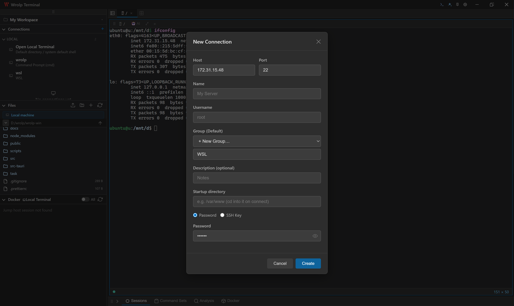
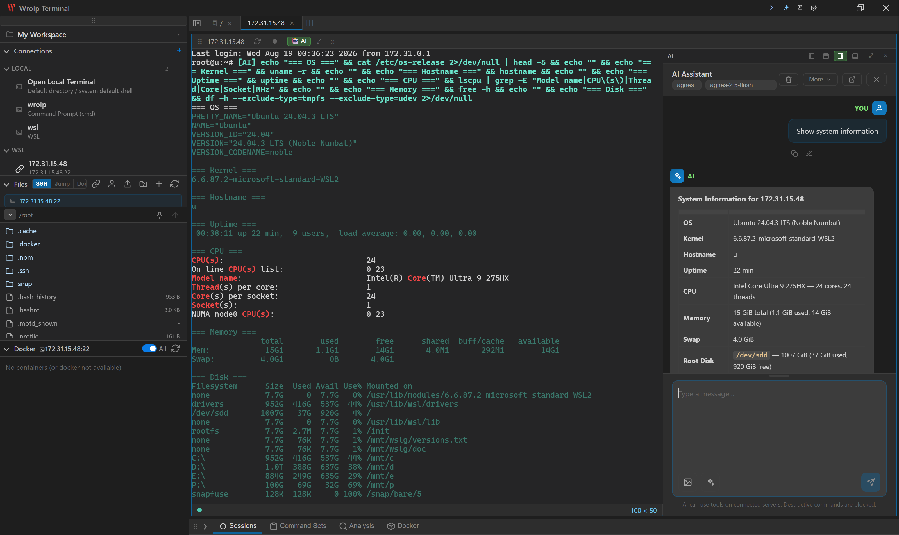

# Wrolp Terminal

<p align="center">
  
</p>

<p align="center">
  <strong>面向运维人员的桌面端 SSH 终端与服务器管理工具</strong>
</p>

<p align="center">
  <a href="https://github.com/wrolp/wrolp/releases"></a>
  
  
  
</p>

[English](./README.md) · [中文](#)

**Wrolp Terminal** 是基于 Tauri 2 + React 19 + TypeScript 的桌面端 SSH 终端客户端。原生后端使用 Rust 编写，通过纯 Rust 异步库 [`russh`](https://github.com/warp-tech/russh) 直连远程服务器。文件传输与远程编辑使用 `russh-sftp`。以 Windows 为主（打包为 MSI），但也支持 Linux / macOS 构建。

> **说明**：本 README 描述了代码当前的状态。应用早已不止是一个单标签 JSON 终端，现已包含多标签 SSH、SFTP 文件管理、远程文件编辑器、会话录制、命令集、Docker / 主机分析、带工具调用的 AI 助手等功能。

## ✨ 功能亮点

- 🖥️ **多标签 SSH 终端** — 基于 xterm.js，支持密码 / 密钥认证与自动重连
- 💻 **本地终端** — 在本机打开 Shell 并浏览本地文件，与远程标签并排使用
- 📂 **SFTP 文件管理** — 上传 / 下载支持暂停与续传，远程文件树浏览
- ✍️ **远程文件编辑器**（Monaco）— 自动识别 UTF-8 / GBK 编码
- 🔍 **Hex 与图片查看** — 以十六进制转储查看二进制文件，或直接预览图片
- 🎬 **会话录制** — 存入 SQLite，可在底部面板回放
- 🐳 **Docker 与主机分析** — 查看容器、流式日志、分析服务器
- 🤖 **AI 助手** — 支持工具调用 Agent 模式、多模态输入，API Key 加密存储
- 🪟 **浮动窗口与分栏布局** — 自由分割终端区域，并将面板弹出为独立浮动窗口
- 🪟 **精致体验** — 自定义标题栏、托盘图标、窗口状态记忆、自动更新

## 📸 截图

### 新建连接

<p align="center">
  
</p>

### AI 助手

<p align="center">
  
</p>

## 功能特性

### SSH 终端
- **连接管理**：增删改查连接配置、分组、拖拽排序、重命名分组。可右键连接进行连接 / 编辑 / 删除与分栏打开（右 / 下）；删除使用应用内确认对话框（`ConfirmDialog`），而非浏览器的 `confirm()`。
- **交互式终端**：每个标签使用 xterm.js 渲染，支持多标签切换。
- **认证方式**：支持密码与 SSH 密钥认证。
- **PTY**：`xterm-256color` PTY + Shell，支持窗口大小调整。
- **重连**：复用标签会复用同一实例；通过过期的任务守卫（`session_id` 单调递增计数器）防止被取代的后台任务破坏状态。
- **工作目录同步**：SFTP 操作与在 Shell 中输入的 `cd` 保持同步（`poll_working_dir` 会在一次性 exec 通道上执行 `pwd`）。

### SFTP 文件管理
- 远程文件树浏览器（侧边栏 `FilePanel`）。
- 列举 / 读取 / 写入 / 重命名 / 删除 / 新建目录。
- 上传与下载（文件或原始字节），支持**暂停 / 继续**，并通过 `transfer-progress` 事件上报进度。
- 切换 SFTP 操作用户（`switch_sftp_user` / `revert_sftp_user`），以其他账号身份操作。

### 远程文件编辑器
- 基于 Monaco 的远程文件内联编辑器，以分栏树面板或浮动窗口形式呈现。
- 编码自动检测：UTF-8 → GBK（`encoding_rs`）；非 UTF-8 文件会被标记，必须以相同字符集重新保存。

### 本地终端与本地文件
- 可将**本地 Shell** 作为顶层标签打开，也可在现有工作区内作为分栏面板打开（`openLocalShellTab` / `handleOpenLocalSplit`）；在本机运行原生 Shell。
- **本地文件浏览器**：通过同一套 `FilePanel` / `FileEditor` 界面在本机浏览与编辑文件。一个 `LocalFs`（`local_fs.rs`）实现了与 SFTP 相同的 `RemoteFs` trait，因此本地与远程目标共用同一套代码路径。在 Windows 上本地根目录映射到当前盘符的根。

### Hex 与图片查看器
- 在编辑器中打开的二进制文件可以十六进制转储方式查看（`hex_base64` + `HexViewer.tsx`）。
- 图片文件支持内联预览；后端通过 `image_mime` / `detect_image_mime` 上报 MIME 类型。

### 浮动窗口与分栏布局
- 终端区域采用**分栏树**布局（`splitTree.ts`）：标签可水平或垂直分割，每个叶节点显示终端、Docker 日志或已打开的文件编辑器。
- 任意面板都可**弹出**为浮动窗口（`floatPane` / `FloatingWindow.tsx`，`position: fixed`，z-index 从 1000 起）。终端浮动会从树中摘下该叶节点（会话保持存活）；文件编辑器 / Docker 日志的浮动以覆盖层形式渲染在依然挂载的 Shell 之上，关闭浮动时恢复 `shellView`。
- **按会话隔离的视图状态**（`shellView` / `activeEditorKey` 均为 `Record<number, ...>`）让每个标签打开的文件与 Docker 日志互不干扰 —— 在某个会话中打开的文件不会出现在另一个会话里。

### 会话录制
- 默认开启录制（可通过 `WROLP_RECORDING=0` / `false` 关闭）。
- 事件先缓存在内存中，每 5 秒及断开连接时刷入 SQLite 的 `session_events` 表。
- 两类事件：`input`（原始按键）与 `command`（回车时捕获的完整命令行，保留 Tab 补全文本）。
- 底部面板提供浏览器（`SessionListPanel` / `SessionViewer`），可删除 / 回放录制内容。

### 命令集
- 在 SQLite 中保存可复用的命令组（可选绑定到某个连接）。
- 通过底部面板的 `CommandSetPanel` 管理。

### Docker 与主机分析
- `analyze_host`：对连接中的服务器做只读分析（操作系统、内核、架构、软件包、已安装工具）。
- `analyze_docker_container` + `docker_container_logs`：检视容器并流式获取其日志（`docker_logs_stream_start` / `poll_docker_logs` / `stop_docker_logs_stream`）。
- **Docker 日志标签与浮动**：容器的日志可作为一个独立的日志标签打开，并弹出为浮动窗口。标签重连时会自动重新发送其 `postConnectCmd`（例如原始的 `docker exec`），从而让面板在重连后保持一致。
- `command_help`：查询连接服务器上某命令的帮助 / 手册文本。
- 相关 UI 面板：`DockerPanel`、`DockerLogViewer`、`DockerAnalysisPanel`、`HostAnalysisPanel`。

### AI 助手
- 聊天面板（`AiChatPanel`），含两种模式：
  - **对话**（非流式，`ai_chat_sync`）。
  - **智能体**（带工具调用的流式模式，`run_agent_stream`）—— 一个完整的智能体循环，可在连接的服务器上调用工具。
- **多模态输入**：可在消息中附加图片（后端通过 `openai_content` 接受结构化的多段 `content`），让模型能理解截图、示意图等。
- **模板与重发**：在图片按钮旁通过模板下拉框插入提示词；可**编辑并重新发送**任意历史消息（基于编辑后的内容重新运行）。
- **暂停**：通过 `cancel_ai_chat` 中止正在进行的对话 / 智能体生成，并从中断处继续。
- **多 API 端点**：可保存多个 `AiEndpointProfile`，各自拥有加密的 API Key、端点 URL、模型与系统提示词。可选择一个作为当前激活配置。旧版单端点配置会自动迁移。
- **模型获取**：`list_ai_models` 调用 `{endpoint}/v1/models` 填充模型下拉框；始终支持手动输入。
- **智能体工具**（分发到拥有 `AppState` 访问权限的 Rust 后端）：`run_command`、`analyze_server`、`list_directory`、`read_file`、`list_connections`、`search_help` 等。工具调用归组在其对应的助手消息下，以工具卡片形式展示，并带有生命周期事件（`pending` → `executing` → `done`/`error`）。助手消息中的 Bash 代码块提供一键**复制**按钮。
- **安全性**：API Key 通过 AES-256-GCM 文件保险库加密存储（`encrypt_api_key` / `decrypt_api_key`）。加密密钥为机器专属文件（`vault.key`），不使用操作系统密钥环。

### 窗口与系统集成
- 自定义标题栏（窗口 `decorations: false`）；窗口位置 / 尺寸 / 透明度持久化（`window.json`）。
- 关闭时隐藏、系统托盘图标、自动更新（GitHub Release 端点 —— 发布前需在 `tauri.conf.json` 中设置真实 `pubkey`）。
- 持久化的连接配置（`connections.json`）与 SQLite 数据库（`wrolp.db`，WAL 模式）存放在 OS 配置目录下的 `wrolp-terminal/`。

## 系统依赖

### Linux（Debian / Ubuntu）

```bash
sudo apt-get install -y pkg-config libdbus-1-dev libssl-dev libgtk-3-dev libjavascriptcoregtk-4.1-dev libsoup-3.0-dev libwebkit2gtk-4.1-dev
```

### macOS / Windows

无需额外依赖。

## 安装

### 1. 安装 Rust 工具链

```bash
curl --proto '=https' --tlsv1.2 -sSf https://sh.rustup.rs | sh
```

### 2. 安装前端依赖

已提交 `yarn.lock`，建议使用 `yarn`：

```bash
yarn        # 或：npm install
```

## 开发

```bash
yarn tauri dev      # 或：npm run tauri dev
```

Tauri 2 会在加载前端前，通过 `beforeDevCommand` 自动启动 Vite 开发服务器。

仅前端开发服务器（不含 Rust / SSH，适合界面开发）：

```bash
yarn dev
```

### 调试 Rust 后端

- **日志**：后端诊断信息通过 `eprintln!` 输出到 stderr（在 `yarn tauri dev` 终端中可见）。在需要处添加 `eprintln!("[module] ...")` 即可。
- **静态检查 / 测试**：
  ```bash
  cd src-tauri
  cargo check                 # 类型检查
  cargo build                 # 调试构建
  cargo clippy                # Lint
  cargo test                  # 运行全部 Rust 单元测试
  cargo run --bin ssh_test    # 独立的 russh 连通性探测（src/ssh_test.rs）
  ```
- **断点调试**：`.vscode/launch.json` 中的 `Debug Tauri (dev)`（需 CodeLLDB 扩展）会以 `RUST_BACKTRACE=1` 构建并启动二进制。注意它启动的是独立进程 —— 不要同时运行 `yarn tauri dev`。多数后端工作通常使用 `yarn tauri dev` 配合 `eprintln!` 日志即可。
- **注意事项**：终端输出通过轮询（`poll_output`）获取而非事件流；新增的 `#[tauri::command]` 需要重新构建后端（重启 `yarn tauri dev`）。

## 构建

```bash
yarn tauri build     # 或：npm run tauri build
```

输出目录：`src-tauri/target/release/bundle/`。打包目标仅 `["msi"]`。

### 清理重建

```bash
cd src-tauri && cargo clean && cd ..
# 然后：
yarn tauri build
```

## 项目结构

```
├── src/                            # 前端源码
│   ├── App.tsx                     # 单一编排器：顶层状态 + 布局
│   ├── main.tsx                    # 入口
│   ├── types.ts                    # 与 Rust 共享的 TS 类型（camelCase）
│   ├── commands.ts                 # 全部 Tauri 命令封装（每个命令一个导出）
│   ├── i18n/                       # 国际化（中 / 英）
│   │   ├── index.tsx               # I18nProvider / useI18n / t()
│   │   ├── en.ts                   # 英文文案
│   │   └── zh.ts                   # 中文文案
│   ├── styles/                     # SCSS
│   │   ├── index.scss              # 全局基础样式
│   │   ├── App.scss                # 应用布局与组件样式
│   │   └── _variables.scss         # 共享变量（颜色等）
│   └── components/
│       ├── Titlebar.tsx            # 自定义标题栏（关闭窗口装饰）
│       ├── ConnectionManager.tsx   # 连接增删改查、分组、拖拽排序
│       ├── Terminal.tsx            # 每标签的 xterm.js + 100ms poll_output 循环
│       ├── FilePanel.tsx           # 远程 SFTP 文件树
│       ├── FileEditor.tsx          # 基于 Monaco 的远程文件编辑器
│       ├── AiChatPanel.tsx         # AI 聊天 / 智能体界面
│       ├── BottomPanel.tsx          # 会话 + 命令集容器
│       ├── SessionListPanel.tsx    # 会话录制浏览器
│       ├── SessionViewer.tsx       # 录制回放
│       ├── CommandSetPanel.tsx     # 命令集界面
│       ├── DockerPanel.tsx         # Docker 容器 / 分析
│       ├── DockerLogViewer.tsx     # Docker 日志流查看器
│       ├── DockerAnalysisPanel.tsx # Docker 分析结果
│       ├── HostAnalysisPanel.tsx   # 主机分析结果
│       ├── ConfirmDialog.tsx       # 可复用的确认对话框
│       ├── Icon.tsx                # SVG 图标
│       ├── FloatingWindow.tsx      # 作为浮动窗口渲染的弹出面板
│       ├── HexViewer.tsx           # 二进制文件的十六进制查看器
│       └── splitTree.ts            # 分栏树辅助函数（水平 / 垂直分栏布局）
├── src-tauri/                      # Rust 后端
│   ├── src/
│   │   ├── main.rs                 # 应用入口
│   │   ├── lib.rs                  # Tauri 构建器、插件、SQLite 初始化、托盘、录制刷新、invoke_handler
│   │   ├── commands.rs             # 全部 #[tauri::command] 处理函数
│   │   ├── ssh_session.rs          # AppState、SshSession、SshHandler、ConnectionConfig、TransferControl
│   │   ├── ai.rs                   # AI 聊天 / 智能体、工具定义、模型获取
│   │   ├── db.rs                   # SQLite 访问（录制 + 命令集）
│   │   ├── vault.rs                # 加密的 API Key 存储（AES-256-GCM 文件保险库）
│   │   ├── remote_fs.rs            # SFTP 辅助函数
│   │   ├── local_fs.rs             # 本地文件系统（LocalFs，实现 RemoteFs trait）
│   │   ├── docker_fs.rs            # Docker 日志 / 分析辅助函数
│   │   ├── docker_analysis.rs      # Docker 分析逻辑
│   │   ├── host_analysis.rs        # 主机分析逻辑
│   │   ├── schema.sql              # SQLite 结构定义
│   │   └── ssh_test.rs             # 独立的 russh 测试二进制
│   ├── Cargo.toml
│   ├── tauri.conf.json             # Tauri 配置（msi 打包、透明窗口）
│   ├── capabilities/default.json   # Tauri API 权限
│   └── build.rs
├── scripts/
│   └── generate-icons.mjs          # 重新生成应用图标
├── package.json
├── tsconfig.json
├── vite.config.ts
└── yarn.lock
```

## 技术栈

- **前端**：React 19 + TypeScript + xterm.js + Monaco 编辑器 + Vite + SCSS
- **后端**：Tauri 2 + Rust (tokio) + russh / russh-sftp
- **SSH**：纯 Rust 异步 SSH 客户端 [`russh`](https://github.com/warp-tech/russh)
- **IPC**：Tauri `invoke` 命令 + 前端轮询终端输出（Windows 后台线程的权宜之计）。仅 `connection-closed` 与 `transfer-progress` 使用 Tauri 事件。
- **存储**：JSON（`connections.json`、`window.json`）+ SQLite（`wrolp.db`，WAL）用于录制与命令集；机密通过 AES-256-GCM 文件保险库加密（不使用 OS 密钥环）。

## 约定

- 与 Rust 共享的类型在 Rust 侧使用 `#[serde(rename_all = "camelCase")]`，并在 `src/types.ts` 中使用对应的 camelCase 接口。
- 前端格式由 Prettier 强制约束（`.prettierrc`：singleQuote、no semi、printWidth 100）—— 运行 `yarn format`。
- 新增后端命令必须同时在 `commands.rs` 与 `lib.rs` 的 `generate_handler!` 列表中注册。

## 致谢

- [russh](https://github.com/warp-tech/russh) —— 纯 Rust 异步 SSH 客户端
- [Tauri](https://tauri.app/) —— 应用框架
- [React](https://react.dev/) —— UI 库
- [xterm.js](https://xtermjs.org/) —— 终端渲染
- [Monaco Editor](https://microsoft.github.io/monaco-editor/) —— 代码编辑器
- ……以及许多其他让本项目得以实现的开源库。
